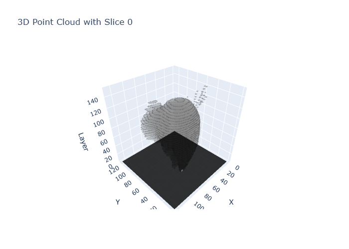
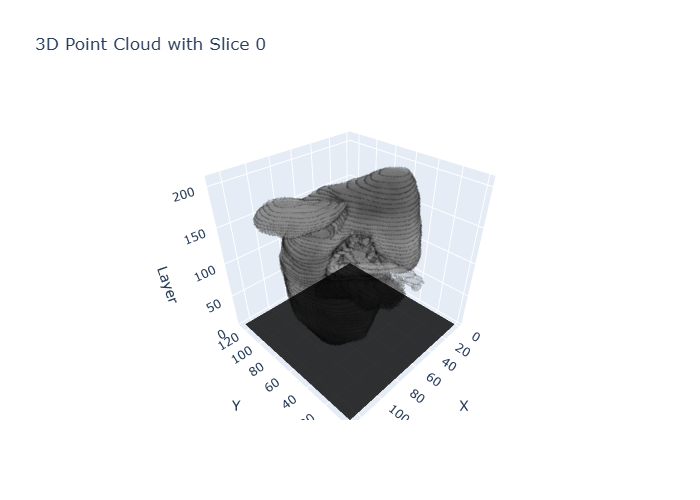

# Supplementary Materials for "Development and Evaluation of a Novel Biomechanics-guided Contrast-enhanced CT Volume Synthesis Model"

This repository contains the supplementary materials for the paper titled **"Development and evaluation of a novel organ-specific biomechanics-guided contrast-enhanced CT volume synthesis model"**. The data includes CECT scans, deformed models, and trained weights related to the methods presented in the paper. Some of the larger files could not be uploaded to GitHub due to size limitations and have been made available via Baidu Netdisk.

> **Note:** As this paper is accepted by Physics in Medicine & Biology, please ensure that you cite the paper appropriately when using this dataset.:

> **Du, S., Shen, M., Liu, Y., Wei, F., & Lei, Y. (2025). Development and evaluation of a novel organ-specific biomechanics-guided contrast-enhanced CT volume synthesis model. Physics in Medicine & Biology. Accepted manuscript online 15 October 2025. https://doi.org/10.1088/1361-6560/ae13ce**

## Dataset Access

### Large Files
Some of the larger files (e.g., full CECT scans) are hosted on **Baidu Netdisk** due to GitHub's file size limitations. You can download these files using the following links:

- **[Download Link for Large Files](https://pan.baidu.com/s/1CO_TV-GiTIlsWyorvfab9g)** (Password: `yvay`)

Please follow the link to download the necessary files.

## In-HouseLiverCECT
This folder contains a dataset of 15 annotated porcine abdominal CECT scans, primarily focused on the liver region. These scans have been annotated by experts and stored in `.MCS` format. This data serves as the foundation for liver segmentation research and can be used for the evaluation of image analysis algorithms.

## Kidney and Liver Folders
These two folders contain CECT images generated using the method proposed in the paper, specifically for the deformation of kidney and liver organs. Currently, only two typical cases are publicly available; additional results will be made available upon paper acceptance. The folder contents are as follows:

- **DeformedSTL**: Deformed 3D models of the kidney or liver stored in STL format.
- **Image**: Deformed CECT images stored in standard image formats (e.g., `.png` or `.jpg`).
- **Segment**: Segmented images of the individual organs (kidney or liver).
- **Mask**: Corresponding masks for the segmented organs in the `Image` folder.
- **1.nii.gz**: Deformed CECT images in NIfTI format (standard CT format).
- **Contrast**: CECT images with enhanced contrast for improved visualization.
- **Trans**: CECT images showing transition regions that highlight specific anatomical areas.

These datasets are intended for researchers working with organ segmentation, biomechanical modeling, and image enhancement in CECT scans.

## YOLO Weights and VoxelMorph Weights
This section includes two sets of trained model weights used in the research:

- **yoloWeights**: YOLOv1.1 weights for object detection, trained on the augmented dataset used in this work.
- **voxelmorphWeights**: VoxelMorph weights for image registration and deformation tasks, also trained on the dataset described in the paper.

These pre-trained weights can be used to reproduce the results and methods discussed in the paper, as well as for further experimentation with CECT data.

For Yolo11, please refer to https://github.com/ultralytics/ultralytics.

For VoxelMorph, please refer to https://github.com/zuzhiang/VoxelMorph-torch.

For the other dataset used in our paper, please refer to:
KiPA2022: https://kipa22.grand-challenge.org/
3Diircab: https://www.ircad.fr/research/data-sets/liver-segmentation-3d-ircadb-01/

## CECTVolumeGIF
This directory contains GIFs that visually demonstrate the synthesized 3D CECT volumes, including on the liver and kidney CT volumes. The GIFs provides a slice-by-slice view of the synthesized images. These visualizations offer an intuitive understanding of the generated CECT volumes, showcasing their structural and textural consistency.

## Contents:

Liver: Slice-by-Slicevisualization of the liver CT volume.

Kidney: Slice-by-Slice visualization of the kidney CT volume.

Due to the computational cost of generating full voxel volumes at a resolution of 512x512, we applied some downsampling to the images for efficiency.

## Example GIFs:
- **Liver CT Volume**  
  

- **Kidney CT Volume**  
  

## Usage
To use these datasets and weights, you can download the relevant folder (e.g., "Kidney" or "Liver"). The data can be processed using standard medical image analysis software or custom scripts. The pre-trained weights are ready to be used with deep learning frameworks like PyTorch for object detection and image deformation tasks.

## Citation
Please cite the following paper when using this dataset:

**Du, S., Shen, M., Liu, Y., Wei, F., & Lei, Y. (2025). Development and evaluation of a novel organ-specific biomechanics-guided contrast-enhanced CT volume synthesis model. Physics in Medicine & Biology. Accepted manuscript online 15 October 2025. https://doi.org/10.1088/1361-6560/ae13ce**

(Note: Citation details will be provided once the paper is accepted and published.)

## License
The copyright of the dataset is held by authors. It is licensed under the Creative Commons Attribution-NonCommercial 4.0 International (CC BY-NC 4.0) license.

## Contact
If you have any question, please contact at shilundu@zju.edu.cn
